# AI-Based-Online-Exam-Proctoring-System

AI BASED ONLINE EXAM PROCTORING SYSTEM
    Online examination system with automatic proctoring is designed using python and flask framework.
    This web application used to conduct online assessment with tech-enabled monitoring website to supervise a test-taker from start to finish
    
A) End User Control Panel

   1)Admin
      Signup/Login
      View Student Details
      Create Exam
      Add/Edit/Delete Questions
      View marks scored by students
   
   2)Student
      Signup/Login
      View their profile
      Attend Exam (Automatic proctoring and Alert system)
      view score

B) Video Proctoring:
   In this module It monitors student through webcam to raises flags in case of any suspicious activity found. Video Proctoring is useful for high stake examinations where a candidate is monitored via a continuous video streaming activity
   
C) Automatic Alert System:
   The exam proctoring software can be configured to automatically send alerts to student when suspicious behavior is detected. 

D) Assessment Reporting:
   The online assessment facilitates quick and clear reports on candidate results and progress. This makes it easier to give useful feedback to candidates on how they are doing, areas where they are strong, and what areas of learning require attention.

SCREENSHOTS:

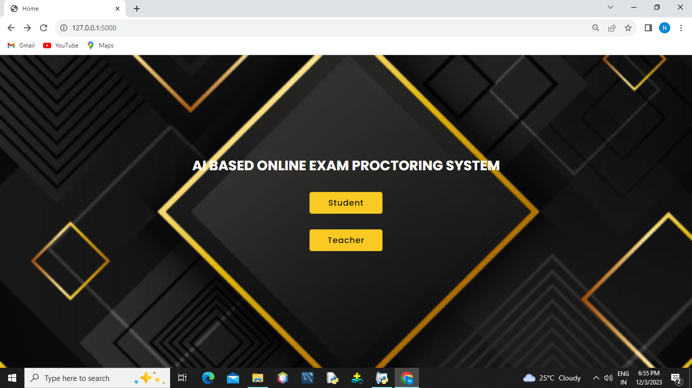

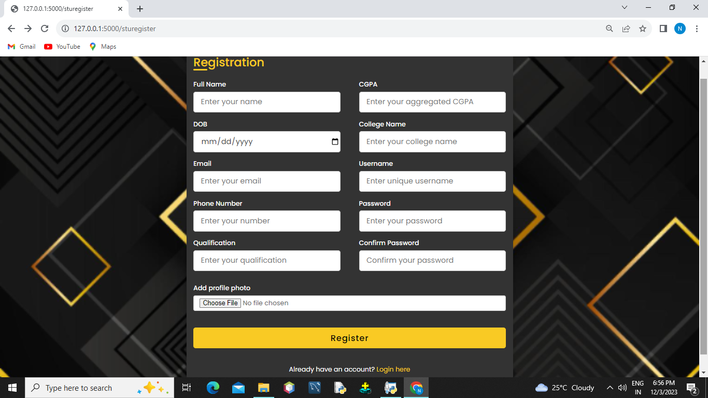

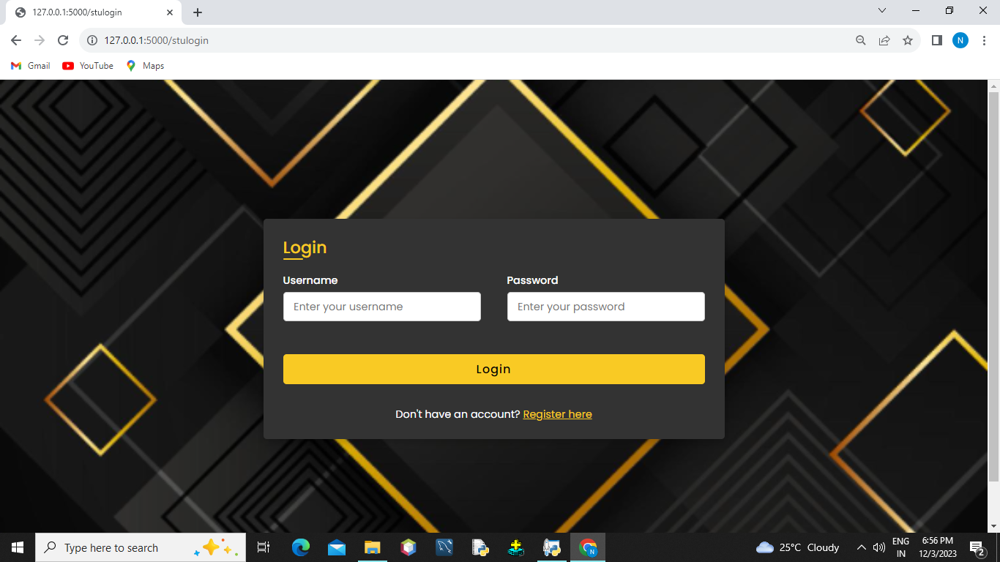

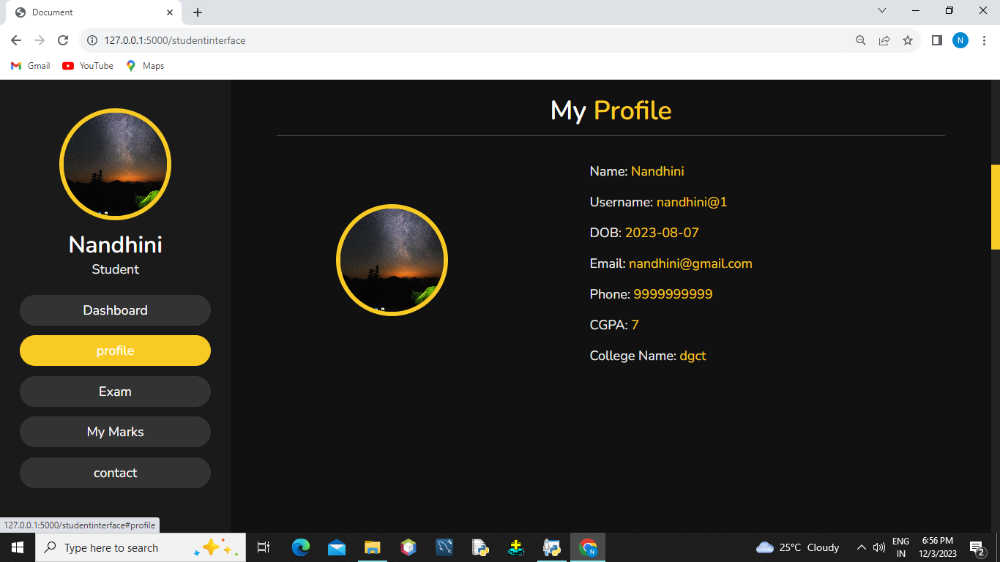

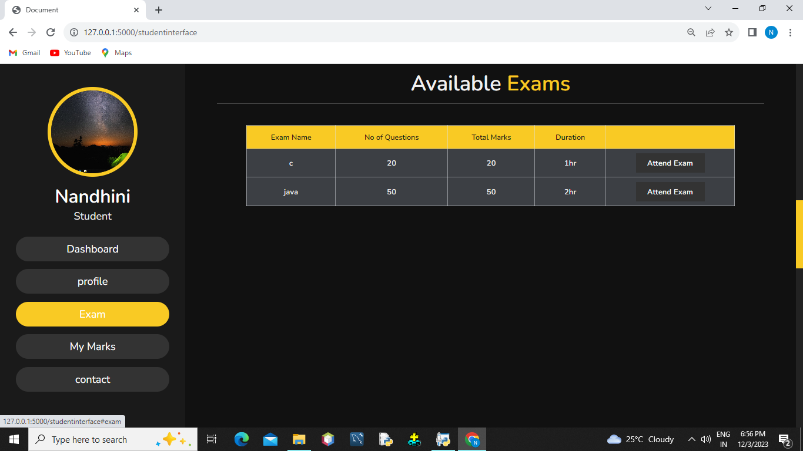

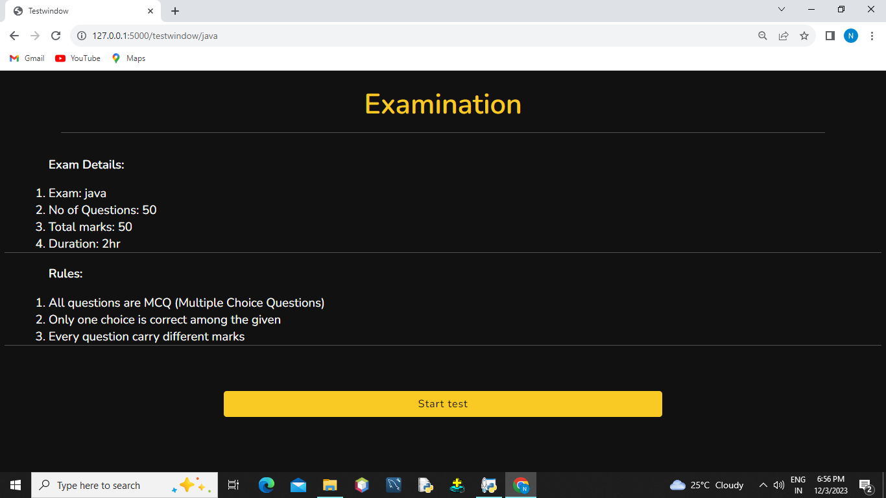

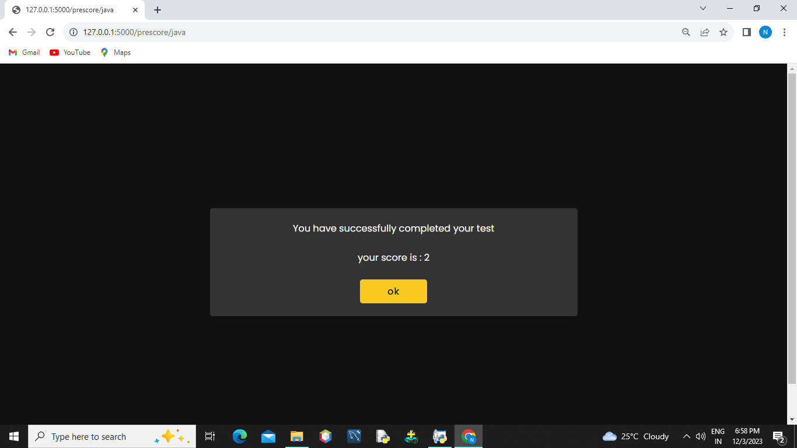

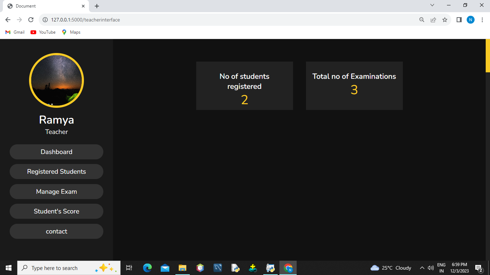

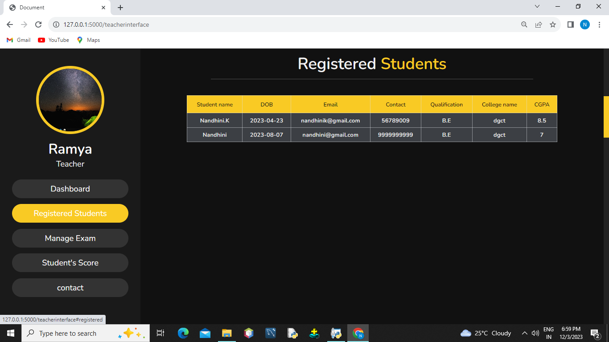

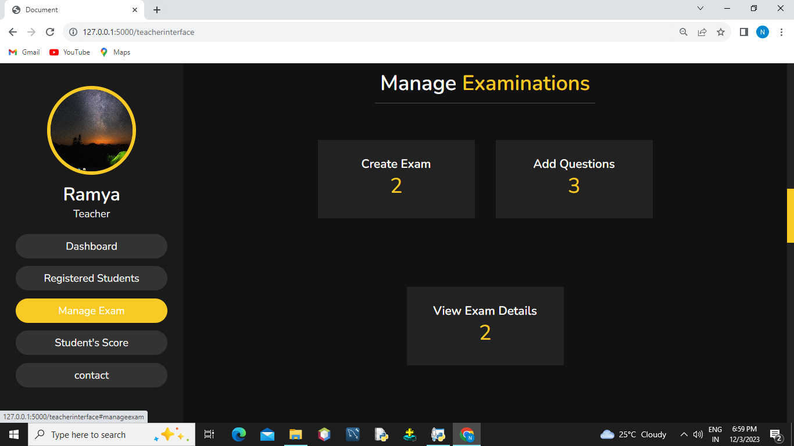

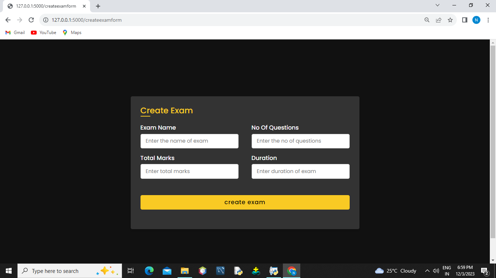

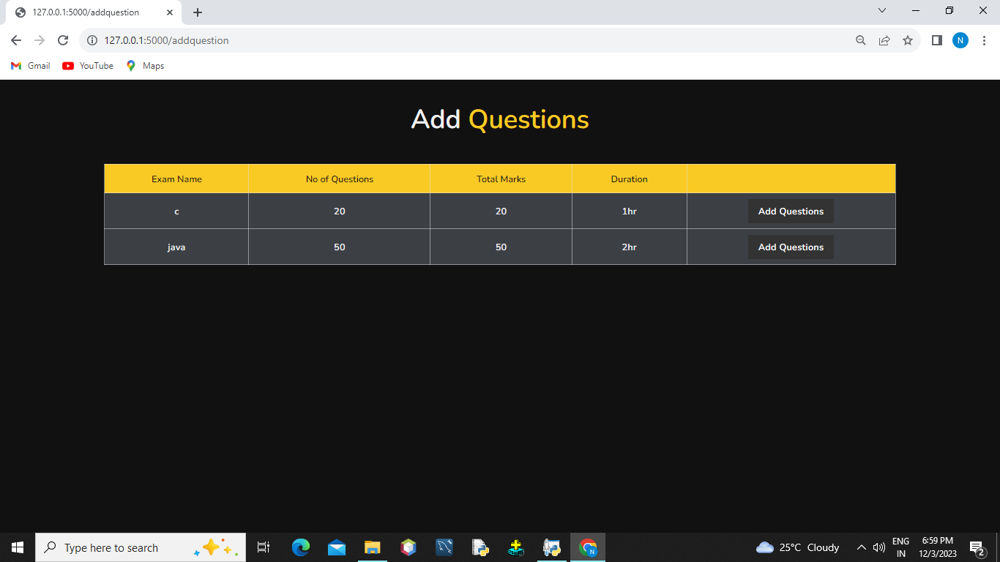

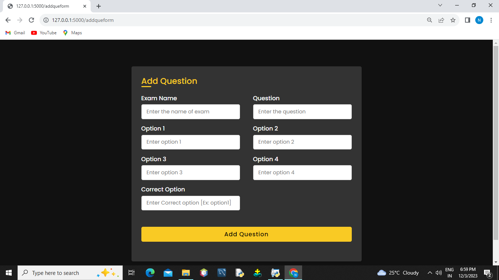

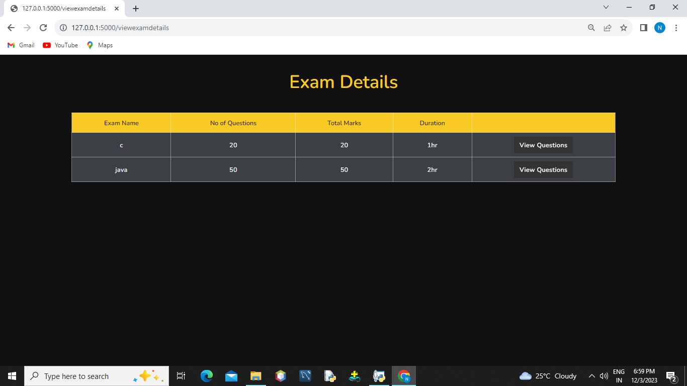

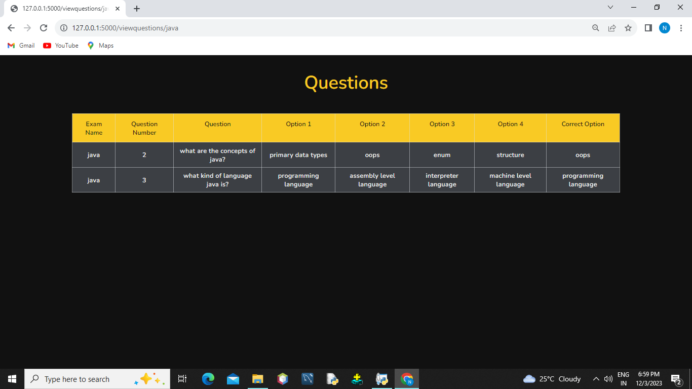

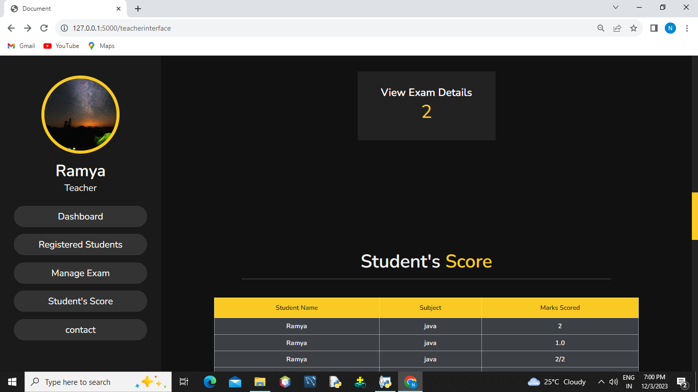

